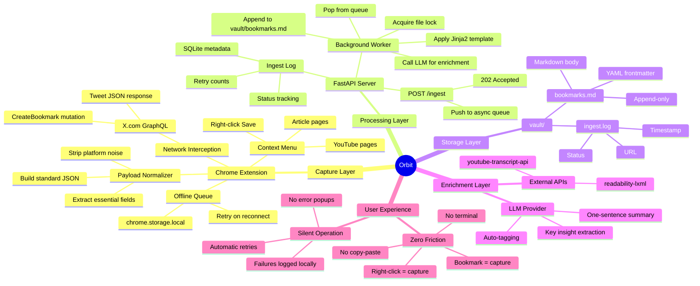

# ORBIT PROTOCOL

## 1. Purpose

This document defines the canonical data structure, file format, and routing rules for every piece of content captured by Orbit. It is the single source of truth for both the Chrome Extension (capture layer) and the Python server (processing layer).

---

## 2. YAML Frontmatter Schema

Every captured bookmark is appended to a Markdown file with the following YAML frontmatter block. This structure is deterministic, machine-readable, and optimized for LLM retrieval.

```yaml
---
id: "<uuid-v4>"
type: "<tweet | thread | youtube | article | podcast>"
source_url: "<canonical URL>"
source_platform: "<x | youtube | medium | substack | other>"
author: "<display name or channel name>"
author_handle: "<@handle or channel slug>"
title: "<tweet first line, video title, or article headline>"
captured_at: "<ISO 8601 timestamp>"
published_at: "<original publish date if available, else null>"
tags: ["<auto-extracted>", "<topic>", "<concept>"]
summary: "<one-sentence LLM-generated summary or null>"
key_insights:
  - "<insight 1>"
  - "<insight 2>"
status: "<ingested | enriched | failed>"
---
```

### Field Definitions

| Field | Type | Required | Source | Notes |
|---|---|---|---|---|
| `id` | string (UUID) | Yes | Generated by server | Guarantees deduplication |
| `type` | enum | Yes | Extension | Determines which template to use |
| `source_url` | string (URL) | Yes | Extension | Canonical link back to original |
| `source_platform` | enum | Yes | Extension | Used for routing and filtering |
| `author` | string | Yes | Extension or API | Display name |
| `author_handle` | string | Yes | Extension | Normalized handle/slug |
| `title` | string | Yes | Extension | First line for tweets, title for articles/videos |
| `captured_at` | string (ISO 8601) | Yes | Extension | When the user bookmarked it |
| `published_at` | string (ISO 8601) | No | Extension or API | Original publish timestamp |
| `tags` | array[string] | Yes | LLM enrichment | Auto-extracted topics; empty array if enrichment skipped |
| `summary` | string or null | No | LLM enrichment | One-sentence distillation |
| `key_insights` | array[string] | No | LLM enrichment | Bullet-point takeaways |
| `status` | enum | Yes | Server | Tracks processing state |

---

## 3. Markdown Body Template

After the frontmatter, the raw content is rendered in a consistent Markdown structure:

```markdown
## Content

<Full tweet text, article body, or video transcript>

## Context

- **Original URL:** <source_url>
- **Captured:** <captured_at>
- **Platform:** <source_platform>

---
```

Each bookmark entry is separated by a horizontal rule (`---`) for clean visual and programmatic parsing.

---

## 4. File Organization

All captured content lives in a single vault directory:

```
vault/
  bookmarks.md          # All captured items, append-only
  ingest.log            # SQLite metadata log (not human-readable)
```

Future versions may split by type (`tweets.md`, `articles.md`, `videos.md`), but V2 uses a single append-only file for simplicity.

---

## 5. Orbit Ecosystem — Mind Map



---

## 6. Why This Structure? (Conversational Walkthrough)

Hey — let me walk you through *why* we're organizing data this way, because the structure is the product.

### The YAML Frontmatter

Think of YAML frontmatter as a **passport** for each piece of content. When an LLM reads your `bookmarks.md` file later, it doesn't need to parse the entire body to understand what it's looking at. The frontmatter gives it structured metadata upfront: *what is this, who wrote it, when was it captured, what topics does it cover?*

This matters because LLMs are expensive to run and limited in context. If you ask "what did I save about distributed systems last month?", the LLM can scan just the `tags` and `captured_at` fields in the frontmatter — it doesn't need to read every word of every bookmark. It's the difference between reading a library's card catalog versus walking every shelf.

### The `type` and `source_platform` Split

You might wonder why we have both `type` and `source_platform`. Here's the distinction:

- **`type`** describes the *format*: is it a single tweet, a thread, a YouTube video, or a long-form article? This determines how the LLM should process it.
- **`source_platform`** describes the *origin*: did it come from X, YouTube, Medium? This matters for routing and filtering.

A YouTube video and a podcast episode might both be `type: video` but have different `source_platform` values. A tweet and a thread are both from X but need different processing.

### The `status` Field

This is our **audit trail**. Every bookmark goes through stages:

1. `ingested` — the server received it and wrote it to disk
2. `enriched` — the LLM has added tags, summary, and insights
3. `failed` — something went wrong (logged, will retry)

If your server crashes mid-processing, the `status` field tells you exactly where each bookmark is in the pipeline. No data is lost, nothing is duplicated.

### The Mind Map

The mind map above is the **entire Orbit ecosystem** in one view. Here's what each branch means:

- **Capture Layer** — everything that happens in your browser. The extension intercepts bookmarks, normalizes the data, and ships it to the server. If the server is down, it queues locally.
- **Processing Layer** — the Python server. It receives data, queues it, enriches it with an LLM, and writes it to disk safely with file locks.
- **Storage Layer** — your vault. A single `bookmarks.md` file that grows over time. No database, no cloud, just plain text on your machine.
- **Enrichment Layer** — the intelligence. LLMs add structure and meaning. External APIs pull in transcripts and clean article text.
- **User Experience** — the philosophy. Zero friction. You bookmark, Orbit handles the rest. No terminal, no config, no thinking.

### Why One File?

You might ask: why not split bookmarks into separate files by type or date? The answer is **simplicity**. One append-only file means:

- No file naming conventions to manage
- No directory structure to navigate
- An LLM can read the entire file in one context window (up to its limit)
- Backups are trivial: copy one file
- Version control is clean: `git diff` shows exactly what changed

When your vault grows beyond what a single LLM context window can handle, we'll add splitting logic. But V2 keeps it simple. File over app. One file over many.

### The Append-Only Guarantee

Every bookmark is **appended**, never modified. If a bookmark needs updating (e.g., enrichment completes later), we append a new version with a new `id`. This gives you:

- An immutable history of everything you've captured
- No risk of overwriting good data with bad
- A natural audit trail

Think of it like a journal. You don't erase entries — you add new ones.
