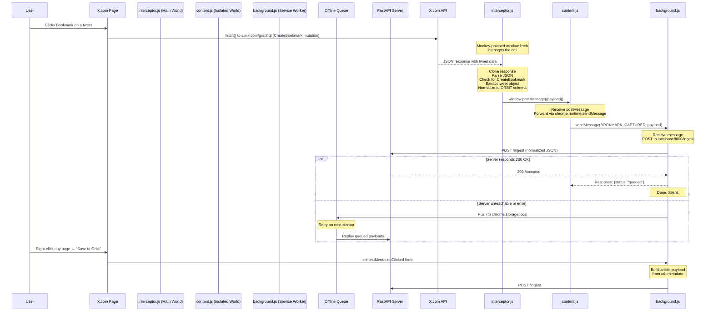

# Extension Docs — Orbit V2 Capture Layer (Fetch Interception)

## 1. Architecture Overview

The Orbit Chrome Extension is the **capture layer** of the system. It intercepts network traffic at the JavaScript level by monkey-patching `window.fetch` and `XMLHttpRequest` in the page's main world, catches the GraphQL responses from X.com's API, normalizes the data, and ships it to your local Python server.

No DOM scraping. No `chrome.webRequest`. No fragile selectors.

---

## 2. Why Fetch Interception? The MV3 Problem

Before we get into the diagram, you need to understand **why** we use this approach instead of `chrome.webRequest`.

### The Manifest V3 Restriction

In Manifest V2, extensions could use `chrome.webRequest` with the `extraInfoSpec: ["responseBody"]` flag to read the body of any network request. This was powerful — it let you inspect, modify, or log any response.

**Manifest V3 removed this ability.** For security reasons, `chrome.webRequest` in MV3 can no longer read response bodies. The `responseBody` option simply doesn't exist. Chrome's official alternative is the `declarativeNetRequest` API, but that API only lets you *block or redirect* requests — it doesn't let you *read* them.

### The Isolated World Problem

Content scripts in Chrome extensions run in an **"isolated world"**. This means:

- They can see and modify the DOM
- They **cannot** access the page's JavaScript globals (`window.fetch`, `XMLHttpRequest`, etc.)
- The page's JavaScript **cannot** access the content script's variables

So if you try to monkey-patch `window.fetch` from a content script, you're patching the content script's own `window.fetch` — not the page's. The page uses its own unpatched version.

### The Solution: Two-Script Injection

To work around both limitations, we use a two-script architecture:

1. **`interceptor.js`** — Runs in the **page's main world**. Monkey-patches `window.fetch` and `XMLHttpRequest`. Can read the actual GraphQL responses. Sends data back via `window.postMessage`.

2. **`content.js`** — Runs in the **extension's isolated world**. Injects `interceptor.js` into the page as a `<script>` tag. Listens for `postMessage` events from the interceptor. Forwards payloads to `background.js` via `chrome.runtime.sendMessage`.

This is the standard workaround for MV3 response interception. It's used by tools like JSON Viewer, GraphQL DevTools, and many API debugging extensions.

---

## 3. Data Flow — Sequence Diagram



---

## 4. Conversational Walkthrough — Learn the Concepts

Let me walk you through every concept in the new architecture. This is a more sophisticated pattern than the V1 DOM scraping, and understanding it will make you a better extension developer.

### What is Monkey-Patching?

Monkey-patching means **replacing a function at runtime** with your own version. In JavaScript, functions are just values assigned to properties. You can overwrite them:

```javascript
const originalFetch = window.fetch;

window.fetch = async function (input, init) {
  // Your code runs first
  console.log("fetch called with:", input);

  // Then call the original
  const response = await originalFetch(input, init);

  // Then do something with the response
  console.log("response status:", response.status);

  return response;
};
```

After this code runs, every call to `fetch()` in the page goes through your wrapper first. You can inspect the arguments, the response, or even modify them. This is how debugging tools, analytics blockers, and API interceptors work.

**Why it's called "monkey-patching":** The term comes from Python, where it means dynamically modifying a module at runtime. It's called "monkey" because it's a bit wild — you're reaching into someone else's code and changing it.

### Why Do We Need Two Scripts?

This is the most important concept to understand. Chrome extensions have **two separate JavaScript worlds**:

| | Isolated World (Content Script) | Main World (Page Script) |
|---|---|---|
| **Can access DOM** | Yes | Yes |
| **Can access page's `window.fetch`** | No — gets its own copy | Yes — the real one |
| **Can use `chrome.runtime`** | Yes | No |
| **Can use `chrome.runtime.sendMessage`** | Yes | No |

The problem: `interceptor.js` needs to read `window.fetch` (main world) AND send data to the extension (isolated world API). No single script can do both.

The solution: Split it.

- **`interceptor.js`** runs in the main world. It patches `window.fetch`, reads responses, and broadcasts results via `window.postMessage` (a browser API that works across worlds).
- **`content.js`** runs in the isolated world. It listens for `postMessage`, then uses `chrome.runtime.sendMessage` to forward the data to `background.js`.

`window.postMessage` is the **bridge** between the two worlds. It's like passing a note through a window — the two rooms can't touch each other, but they can slide messages through.

### How Does the Injection Work?

Content scripts can't directly run code in the main world. But they **can** add `<script>` tags to the DOM:

```javascript
const script = document.createElement("script");
script.src = chrome.runtime.getURL("interceptor.js");
document.head.appendChild(script);
```

When this `<script>` tag is added to the page, the browser loads and executes `interceptor.js` in the **page's context** — not the content script's isolated world. This is because `<script>` tags always run in the main world, regardless of who created them.

`chrome.runtime.getURL()` converts the relative path `interceptor.js` into a full `chrome-extension://...` URL. This is required because the page needs to load the script from the extension's internal storage.

After injection, we remove the `<script>` tag:

```javascript
script.onload = function () {
  this.remove();
};
```

The tag is just a delivery mechanism. Once the script has executed, the monkey-patches are in place on `window.fetch` and `XMLHttpRequest`. The tag itself is no longer needed.

### Why Patch Both `fetch` AND `XMLHttpRequest`?

Modern web apps use `fetch()` for most network calls. But some still use `XMLHttpRequest` (XHR), especially for legacy code or specific browser compatibility. X.com uses both, depending on the feature.

The `fetch` patch is straightforward — we replace the function:

```javascript
window.fetch = async function (input, init) {
  const response = await originalFetch.apply(this, arguments);
  // ... inspect response
  return response;
};
```

The XHR patch is trickier because XHR is a class, not a single function. We patch two methods:

```javascript
XMLHttpRequest.prototype.open = function (method, url) {
  this._orbitUrl = url; // Store the URL for later
  return originalXHROpen.apply(this, arguments);
};

XMLHttpRequest.prototype.send = function () {
  this.addEventListener("load", function () {
    // Response is ready in this.responseText
  });
  return originalXHRSend.apply(this, arguments);
};
```

We store the URL in `open()` because by the time `send()` fires, we need to know what URL this XHR call is targeting.

### What is `response.clone()`?

When you call `response.json()` on a `fetch` response, it **consumes** the response body. You can only read it once. If you consume it, the page's original JavaScript can't read it anymore — and the page breaks.

`response.clone()` creates a copy of the response that you can read independently:

```javascript
const response = await originalFetch.apply(this, arguments);
const clonedResponse = response.clone(); // Copy
const json = await clonedResponse.json(); // Read the copy
return response; // Return the original — page can still read it
```

This is critical. If we don't clone, we steal the response from X.com's own code, and the bookmark button stops working.

### How Does `postMessage` Work?

`window.postMessage()` sends a message from one window/frame to another. In our case, it sends a message from the main world (interceptor) to the isolated world (content script):

```javascript
// In interceptor.js (main world)
window.postMessage(
  { source: "orbit-interceptor", type: "bookmark-captured", payload },
  "*"
);

// In content.js (isolated world)
window.addEventListener("message", (event) => {
  if (event.data.source !== "orbit-interceptor") return;
  if (event.data.type !== "bookmark-captured") return;
  // Forward to background.js
  chrome.runtime.sendMessage({ type: "BOOKMARK_CAPTURED", payload: event.data.payload });
});
```

The `"*"` as the second argument means "send to any origin." In a production security-hardened extension, you'd use the specific origin (`https://x.com`). For a personal tool, `"*"` is fine.

We include `source: "orbit-interceptor"` as a **namespace** to avoid collisions. Other extensions or page scripts might also use `postMessage`. By checking the `source` field, we make sure we only process our own messages.

### What is `chrome.runtime.onMessage`?

This is the background service worker's **inbox**. When any part of the extension (content script, popup, options page) calls `chrome.runtime.sendMessage()`, the message arrives here:

```javascript
chrome.runtime.onMessage.addListener((request, sender, sendResponse) => {
  if (request.type === "BOOKMARK_CAPTURED") {
    sendToServer(request.payload);
    sendResponse({ status: "queued" });
    return true; // Keep channel open for async
  }
});
```

The `return true` is critical. By default, `onMessage` listeners are synchronous — if you return, the message channel closes. But `sendToServer()` is async (it does network I/O). `return true` tells Chrome: "I'll call `sendResponse()` later, don't close the channel yet."

### The Complete Request Lifecycle

Here's the full journey of a single bookmark, step by step:

1. **You click Bookmark** on X.com
2. **X.com's JavaScript calls `fetch()`** to `api.x.com/graphql` with the CreateBookmark mutation
3. **Our monkey-patched `window.fetch` intercepts** the call (it runs before the original)
4. **We call the original `fetch`** and wait for the response
5. **We clone the response** so X.com's code can still read it
6. **We parse the cloned response** as JSON
7. **We check if it's a CreateBookmark response** by looking for `data.createBookmark`
8. **We extract the tweet object** by walking the nested JSON structure
9. **We normalize it** to the ORBIT schema (strip noise, keep essentials)
10. **We broadcast via `window.postMessage`** to the content script
11. **Content script receives** the message and forwards it via `chrome.runtime.sendMessage`
12. **Background service worker receives** the message
13. **Background POSTs** to `localhost:8000/ingest`
14. **If the server responds 202**, we're done. Silent. Invisible.
15. **If the server is down**, we retry 3 times with backoff
16. **If all retries fail**, we queue it in `chrome.storage.local`
17. **On next startup**, we replay the queue

The user experiences: click bookmark → bookmark icon turns blue. That's it. Everything else happens in the background.

### Why `run_at: "document_start"`?

In `manifest.json`, the content script is configured with `"run_at": "document_start"`:

```json
"content_scripts": [{
  "matches": ["*://*.x.com/*"],
  "js": ["content.js"],
  "run_at": "document_start"
}]
```

This means the content script runs **before the page's own JavaScript executes**. This is critical because:

- We need to monkey-patch `window.fetch` **before** X.com's code calls it
- If we run after X.com's code has already cached a reference to the original `fetch`, our patch won't catch those calls

`document_start` fires as soon as the DOM starts building — before any `<script>` tags in the page execute. This gives us the earliest possible injection point.

### Error Handling and Silent Failures

Every step of this pipeline is wrapped in `try/catch`. If the response isn't JSON, if the GraphQL structure is unexpected, if the server is down — we log it and move on. The user never sees an error.

This is intentional. Orbit is an ambient tool. If it breaks silently, the worst case is that one bookmark doesn't get saved to your vault. The user can always manually save it later. But if it shows error popups, the user loses trust and disables the extension.

### The Big Picture

```
┌─────────────────────────────────────────────────────┐
│                    X.com Page                        │
│                                                      │
│  ┌──────────────────────────────────────────────┐   │
│  │  Main World (interceptor.js)                  │   │
│  │  - Monkey-patches window.fetch                │   │
│  │  - Monkey-patches XMLHttpRequest              │   │
│  │  - Reads GraphQL responses                    │   │
│  │  - Sends via window.postMessage               │   │
│  └──────────────────────────────────────────────┘   │
│                       ↕ postMessage                  │
│  ┌──────────────────────────────────────────────┐   │
│  │  Isolated World (content.js)                  │   │
│  │  - Injects interceptor.js as <script>         │   │
│  │  - Listens for postMessage                    │   │
│  │  - Forwards via chrome.runtime.sendMessage    │   │
│  └──────────────────────────────────────────────┘   │
└─────────────────────────────────────────────────────┘
                       ↕ chrome.runtime.sendMessage
┌─────────────────────────────────────────────────────┐
│  Service Worker (background.js)                      │
│  - Receives messages                                 │
│  - POSTs to localhost:8000/ingest                    │
│  - Manages offline queue                             │
└─────────────────────────────────────────────────────┘
                       ↕ HTTP POST
┌─────────────────────────────────────────────────────┐
│  FastAPI Server (server.py)                          │
│  - Async queue                                       │
│  - Background worker                                 │
│  - LLM enrichment                                    │
│  - Append to vault/bookmarks.md                      │
└─────────────────────────────────────────────────────┘
```

This is the V2 capture layer. It's more complex than V1's DOM scraping, but it's fundamentally more robust. We're reading data at the source — the API response — rather than trying to reconstruct it from rendered HTML.
