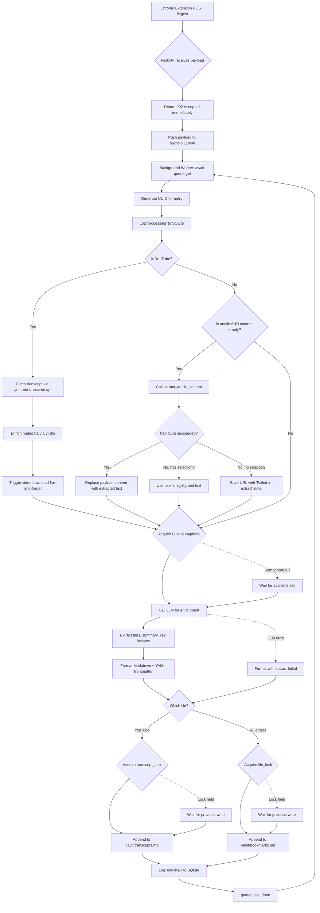
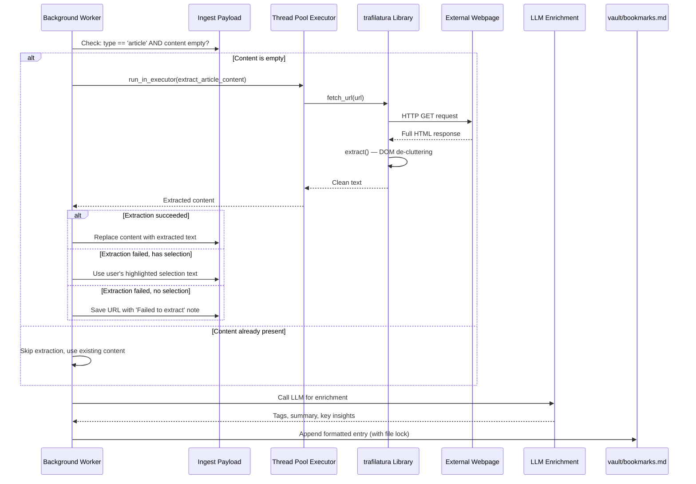
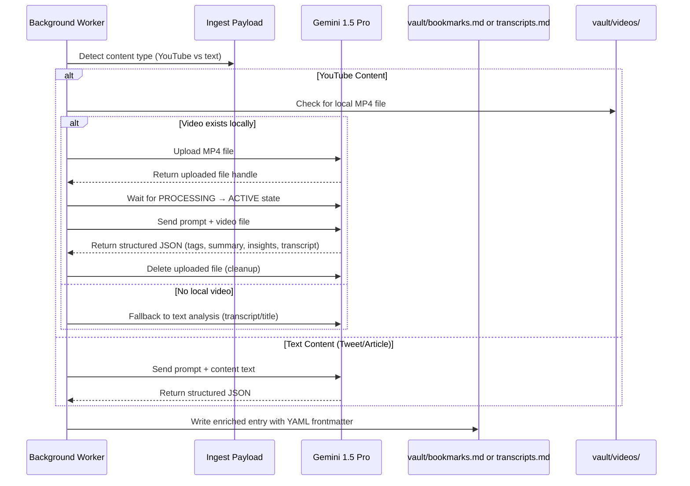

# Server Docs — Orbit V2 Processing Layer

## 1. Architecture Overview

The Orbit Python server is the **processing layer** of the system. It receives normalized JSON payloads from the Chrome Extension, enriches them with an LLM, formats them as Markdown with YAML frontmatter, and safely appends them to `vault/bookmarks.md`.

It's built on FastAPI and uses async patterns throughout — non-blocking ingestion, background processing, and file-safe writes.

---

## 2. Async Queue & File Locking — Flowchart



---

## 2b. Article Extraction — Sequence Diagram



---

## 3. Conversational Walkthrough — Learn the Concepts

Let me walk you through every backend concept in `server.py`. If you're new to async Python, FastAPI, or concurrent file operations, this section is your guide.

### What is FastAPI?

FastAPI is a modern Python web framework for building APIs. It's fast (one of the fastest Python frameworks), type-safe (uses Python type hints for validation), and async-native (supports `async def` endpoints).

Here's what a minimal FastAPI endpoint looks like:

```python
from fastapi import FastAPI

app = FastAPI()

@app.post("/ingest")
async def ingest(payload: IngestPayload):
    await ingest_queue.put(payload)
    return {"status": "accepted"}
```

The `IngestPayload` type is a **Pydantic model** — it validates the incoming JSON automatically. If the client sends a payload missing required fields, FastAPI returns a 422 error before your code even runs. It's like a bouncer at a club checking IDs.

### What is an Async Queue?

An `asyncio.Queue` is a **first-in, first-out data structure** designed for async Python. Think of it like a conveyor belt in a factory:

- **Producers** (the `/ingest` endpoint) put items on one end
- **Consumers** (the background worker) take items off the other end

```python
ingest_queue = asyncio.Queue()

# Producer
await ingest_queue.put(payload)

# Consumer
payload = await ingest_queue.get()
```

**Why use a queue instead of processing directly in the endpoint?** Because LLM calls take 3-10 seconds. If you process synchronously, the Chrome Extension's `fetch()` call hangs for 10 seconds waiting for a response. With a queue:

1. The endpoint puts the payload in the queue (takes ~1ms)
2. Returns `202 Accepted` immediately
3. The background worker processes it at its own pace

The user's bookmark click feels instant. The heavy lifting happens silently in the background.

### What is a Background Worker?

A background worker is a **long-running async coroutine** that lives for the entire lifetime of the server. It's started during `startup` and runs forever in a loop:

```python
@app.on_event("startup")
async def startup():
    asyncio.create_task(background_worker())

async def background_worker():
    while True:
        payload = await ingest_queue.get()
        # ... process payload
        ingest_queue.task_done()
```

`asyncio.create_task()` schedules the coroutine to run concurrently with the rest of the application. It's like hiring a worker who starts their shift when the factory opens and never stops.

**Key detail:** `await ingest_queue.get()` is blocking. When the queue is empty, the worker **pauses** (doesn't spin, doesn't consume CPU) until a new item arrives. It's efficient — it only runs when there's work to do.

### Why Do We Need File Locks?

Here's the problem: if two bookmarks are processed at the same time, and both try to append to `bookmarks.md` simultaneously, their writes can **interleave**. You'd get garbled content:

```
---
id: "abc"
---
---
id: "xyz"
## Content
## Content
---
---
```

An `asyncio.Lock` prevents this. It's like a bathroom key — only one coroutine can hold it at a time:

```python
file_lock = asyncio.Lock()

async with file_lock:
    async with aiofiles.open("bookmarks.md", mode="a") as f:
        await f.write(entry)
```

When Worker A acquires the lock, Worker B **waits** at the `async with file_lock:` line. When Worker A finishes writing and releases the lock, Worker B gets it and proceeds. No interleaving, no corruption.

**Important:** `asyncio.Lock` only works within a single Python process. If you ever run multiple server instances, you'd need a file-level lock (`fcntl.flock`) or a database. For V2, single-process is fine — it's a personal tool.

### What is DOM De-cluttering? (And Why trafilatura?)

When you right-click "Save to Orbit" on an article, the server receives a URL. To save the article's content, it needs to fetch that URL and extract the *actual article text* from the full HTML page.

Here's the problem: a modern webpage's HTML is mostly **noise**.

```
<html>
  <nav>...</nav>           ← Navigation bar (noise)
  <aside>...</aside>       ← Sidebar with ads (noise)
  <footer>...</footer>     ← Footer links (noise)
  <script>...</script>     ← JavaScript bundles (noise)
  <style>...</style>       ← CSS stylesheets (noise)
  <div class="comments">   ← Reader comments (noise)
  <article>                ← THE ACTUAL CONTENT (signal)
    <h1>Why Distributed Systems Are Hard</h1>
    <p>Let me explain...</p>
  </article>
</html>
```

**DOM de-cluttering** is the process of stripping away all the noise — navigation bars, sidebars, ads, footers, scripts, styles, cookie banners, comment sections — and keeping only the main article body. It's like panning for gold: you wash away the dirt and keep the nuggets.

### Why trafilatura Instead of BeautifulSoup?

You *could* use BeautifulSoup to parse HTML and extract content. But BeautifulSoup is a **general-purpose HTML parser** — it gives you tools to navigate the DOM tree, but it doesn't know what an "article" is. You'd have to write your own heuristics:

```python
# The hard way (BeautifulSoup):
soup = BeautifulSoup(html, "html.parser")
# Now what? Find <article> tags? Look for the largest <div>?
# Guess which class names mean "content"?
# Handle 50 different blog templates?
# Good luck.
```

**trafilatura** is a **purpose-built article extractor**. It uses a combination of techniques:

1. **Boilerplate detection** — It knows what navigation bars, sidebars, and footers look like across thousands of websites. It strips them automatically.
2. **Content density scoring** — It measures the ratio of text to HTML tags in each section. Articles have high text density. Navigation has low text density.
3. **Readability heuristics** — It looks for structural patterns: `<article>` tags, `main` elements, paragraphs with sufficient length, headings followed by body text.
4. **Metadata extraction** — It also pulls the title, author, date, and description from `<meta>` tags when available.

```python
# The easy way (trafilatura):
import trafilatura

downloaded = trafilatura.fetch_url("https://example.com/article")
text = trafilatura.extract(downloaded)
# Done. Clean article text. No heuristics to write.
```

It's the difference between building a car engine from scratch (BeautifulSoup) and buying a car (trafilatura). Both get you transportation, but one takes significantly less effort.

### How the Article Extraction Pipeline Works

When an article payload arrives with empty content (which is the normal case — the extension only sends the URL and page title), the background worker triggers extraction:

```python
if payload.type == "article" and not payload.content.strip():
    extracted = await extract_article_content(payload.source_url)
    
    if extracted:
        payload.content = extracted          # Success — full text
    elif payload.selection:
        payload.content = payload.selection   # Fallback — user highlighted text
    else:
        payload.content = "[Failed to extract]"  # Last resort — URL only
```

**Three-tier fallback:**

1. **trafilatura succeeds** — Full article text, clean and de-cluttered. Best case.
2. **trafilatura fails, but user highlighted text** — The extension sends `selection` if the user right-clicked with text selected. Better than nothing.
3. **Both fail** — Save the URL with a note. The bookmark isn't lost — it just lacks body text. You can always visit the URL later.

### Why `run_in_executor`?

`trafilatura` is a **synchronous** library. It uses `requests` under the hood, which blocks the thread. In async Python, blocking the event loop is a cardinal sin — it freezes the entire server.

`run_in_executor` solves this by running the synchronous code in a **separate thread**:

```python
loop = asyncio.get_event_loop()
content = await loop.run_in_executor(
    None, _trafilatura_extract, url
)
```

`None` means "use the default thread pool executor." Python manages a pool of worker threads, and this call hands off the blocking work to one of them. The async event loop keeps running — other requests are processed, the queue keeps moving. When the thread finishes, the result is handed back to the async coroutine.

It's like a restaurant kitchen: the head chef (event loop) doesn't chop vegetables themselves. They delegate to a line cook (thread pool) and keep managing the rest of the kitchen.

### Metadata Enrichment (YouTube)

When you save a YouTube video, the extension only sends the URL and the page title (which is usually something like "Video Title - YouTube"). That's not great metadata. The server enriches it with **real data from YouTube itself**:

```python
metadata = await extract_youtube_metadata(payload.source_url)
if metadata:
    payload.title = metadata["title"]          # Real video title
    payload.author = metadata["channel"]        # Channel name
    payload.published_at = metadata["upload_date"]  # When it was uploaded
```

This is called **metadata enrichment**. The extension sends a rough draft, and the server fills in the blanks by querying the source directly. The result is a bookmark with accurate, complete metadata — not whatever the browser happened to have in the `<title>` tag.

### Why yt-dlp Instead of pytube?

If you've done any YouTube automation in Python, you've probably heard of **pytube**. It was the go-to library for years. Here's why we don't use it in 2026:

| | pytube | yt-dlp |
|---|---|---|
| **Maintenance** | Abandoned since 2023. Multiple critical bugs never fixed. | Actively maintained. Updated weekly. |
| **Breakage** | Breaks every time YouTube changes their API. Often unusable for weeks. | YouTube changes are patched within hours. |
| **Speed** | Slow extraction, no parallelism. | Fast, optimized, supports parallelism. |
| **Features** | Basic download only. | Download, metadata extraction, format selection, subtitles, thumbnails. |
| **Community** | Dead. | 60k+ GitHub stars. Massive contributor base. |

**yt-dlp** is a fork of youtube-dl that became the de facto standard. It's the tool that powers yt-dlp, NewPipe, and countless other projects. When YouTube changes something, the yt-dlp team patches it within hours. pytube? It's been broken more times than it's worked in the last two years.

Think of it this way: pytube is a bicycle with a flat tire. yt-dlp is a Tesla. Both are vehicles, but one actually gets you where you're going.

### The Local Video Backup Policy

Here's the philosophy: **every YouTube video you save gets a local copy**. Not just the transcript. Not just the metadata. The actual MP4 file, stored in `vault/videos/`.

Why? Because YouTube videos can be:
- **Deleted** by the creator
- **Made private** or region-locked
- **Taken down** by copyright claims
- **Altered** (creators sometimes edit videos after publishing)

Your bookmark should be a **permanent record**. If you saved it, you own it. The transcript is the searchable text, but the video file is the source of truth.

The download happens as a **fire-and-forget background task**:

```python
asyncio.create_task(download_video_locally(payload.source_url, video_id))
```

This means:
- The bookmark is saved to `bookmarks.md` **immediately** with the transcript
- The video download starts in parallel and completes whenever it completes
- If the download fails, the bookmark is still saved. No data loss.
- The user never waits for the download to finish

It's like ordering a book at a library. You get the catalog entry right away (the bookmark), and the physical copy arrives when it arrives (the video file).

### How the YouTube Pipeline Works

When a YouTube payload arrives, the worker does three things in sequence:

1. **Transcript extraction** — Fetches the video's transcript using `youtube-transcript-api`. This becomes the `content` field (searchable text for the LLM).

2. **Metadata enrichment** — Uses `yt-dlp` to get the real title, channel name, and upload date. Replaces whatever the extension sent.

3. **Video download** — Triggers `download_video_locally()` as a background task. Downloads the best quality MP4 to `vault/videos/`.

```python
# Step 1: Get transcript
transcript = await get_youtube_transcript(video_id)
payload.content = transcript  # Now the LLM can search this text

# Step 2: Get real metadata
metadata = await extract_youtube_metadata(payload.source_url)
payload.title = metadata["title"]
payload.author = metadata["channel"]

# Step 3: Download video (fire-and-forget)
asyncio.create_task(download_video_locally(payload.source_url, video_id))
```

### Transcript Priority Logic

YouTube offers three types of transcripts:

1. **Manually created** — Written by the creator or a professional. Most accurate.
2. **Auto-generated** — Created by YouTube's speech recognition. Good but imperfect.
3. **Any available** — Whatever exists, even in other languages.

Our code tries them in order:

```python
try:
    transcript = transcript_list.find_manually_created_transcript()
except:
    try:
        transcript = transcript_list.find_generated_transcript()
    except:
        transcript = transcript_list.find_transcript(transcript_list._transcripts[0][0])
```

If none of these work (some videos have no transcript at all), we save the bookmark with a note: `[No transcript available for this video]`. The URL is still saved, and the video still downloads locally.

### The Vault/videos/ Directory

Every downloaded video is saved with a predictable filename:

```
vault/videos/
  dQw4w9WgXcQ_Never Gonna Give You Up.mp4
  jNQXAC9IVRw_Me at the zoo.mp4
```

The format is `{video_id}_{title}.{ext}`. This means:
- You can find a video by its ID (from the bookmark's `source_url`)
- The title is human-readable for manual browsing
- No filename collisions (the ID is unique)

The video download is completely independent of the bookmark ingest. Even if the download fails, your `bookmarks.md` file has the full transcript and metadata. The video is a bonus, not a requirement.

`aiofiles` is an async wrapper around Python's file I/O. Regular file operations (`open()`, `write()`) are **blocking** — they pause the entire event loop while the disk operation completes. `aiofiles` runs file I/O in a thread pool, so other coroutines can keep running:

```python
# Blocking (bad in async code)
with open("bookmarks.md", "a") as f:
    f.write(entry)

# Non-blocking (good in async code)
async with aiofiles.open("bookmarks.md", "a") as f:
    await f.write(entry)
```

For a personal tool with low traffic, the difference is negligible. But it's the right pattern, and it matters when your queue grows.

### What is the LLM Semaphore?

A semaphore is like a **bouncer with a capacity limit**. It allows up to N concurrent operations. We set it to 3:

```python
llm_semaphore = asyncio.Semaphore(3)

async def enrich_with_llm(payload):
    async with llm_semaphore:
        # Call LLM API
```

This means at most 3 LLM calls can happen simultaneously. If 5 bookmarks arrive at once, 3 start processing immediately and 2 wait. This prevents:

- **Rate limiting** — LLM APIs have requests-per-minute limits
- **Memory pressure** — each LLM call holds response data in memory
- **API cost spikes** — uncontrolled concurrency can burn through credits

Think of it like a toll booth with 3 lanes. Cars (LLM calls) line up if all lanes are busy, but they all get through eventually.

### How Does the SQLite Ingest Log Work?

The SQLite database tracks **metadata only** — not the content of bookmarks. It stores:

| Column | Purpose |
|---|---|
| `id` | UUID of the bookmark entry |
| `source_url` | What was captured |
| `type` | tweet, article, youtube, etc. |
| `status` | queued, processing, enriched, failed |
| `retries` | How many times we've retried |
| `created_at` | When it entered the system |
| `updated_at` | When it last changed status |

This is your **audit trail**. If something goes wrong, you can query the log to see exactly what happened:

```sql
SELECT * FROM ingest_log WHERE status = 'failed';
```

SQLite is perfect for this because:
- It's a single file — no server to manage
- It's built into Python — no extra dependencies
- It handles concurrent reads well — the `/status/{id}` endpoint can query while the worker writes
- It's overkill for this use case, but in the best way — zero maintenance

### The YAML Frontmatter Template

The `format_bookmark_entry` function builds the Markdown output. It uses Python f-strings (not a template engine like Jinja2) because the structure is simple and deterministic:

```python
def format_bookmark_entry(payload, entry_id, tags, summary, key_insights, status):
    return f"""---
id: "{entry_id}"
type: "{payload.type}"
source_url: "{payload.source_url}"
...
---

## Content

{payload.content}

## Context

- **Original URL:** {payload.source_url}
...
"""
```

The `_escape_yaml` helper sanitizes strings for safe YAML embedding — it escapes double quotes and strips newlines. This prevents malformed YAML if a tweet contains quotes or line breaks.

### The Complete Request Lifecycle

Let me trace a single bookmark from the Chrome Extension to the final Markdown file:

1. **User bookmarks a tweet** on X.com
2. **Extension intercepts** the GraphQL response, normalizes it, and POSTs to `localhost:8000/ingest`
3. **FastAPI receives** the JSON, validates it against `IngestPayload`, and returns `202 Accepted` (~1ms)
4. **Payload enters** the `asyncio.Queue`
5. **Background worker** picks it up (whenever it's free)
6. **Worker generates** a UUID for this entry
7. **Worker logs** "processing" to SQLite
8. **Worker acquires** the LLM semaphore (waits if all 3 slots are full)
9. **Worker calls** the LLM for enrichment (tags, summary, insights)
10. **Worker formats** the Markdown entry with YAML frontmatter
11. **Worker acquires** the file lock (waits if another write is in progress)
12. **Worker appends** the entry to `vault/bookmarks.md`
13. **Worker releases** the file lock
14. **Worker logs** "enriched" to SQLite
15. **Worker calls** `task_done()` on the queue
16. **Done.** The bookmark is now in your vault, ready for LLM retrieval.

Steps 3 and 4 take ~1ms. Steps 5-16 take 3-10 seconds (mostly the LLM call). The user never waits — the extension got its 202 response in step 3 and moved on.

### Error Handling Philosophy

Every bookmark is written to disk **even if enrichment fails**. If the LLM call throws an error, we still create the entry with `status: "failed"` and minimal frontmatter. This means:

- No data is ever lost
- Failed entries are visible and can be retried manually
- The vault is always complete (some entries may just lack enrichment)

The worst-case scenario is a bookmark with no tags or summary. The best case is full enrichment. Either way, the content is saved.

### How to Run the Server

```bash
# Install dependencies
pip install -r requirements.txt

# Start the server
uvicorn server:app --host 127.0.0.1 --port 8000 --reload

# Or as a background service (macOS)
# Add to ~/Library/LaunchAgents/com.orbit.server.plist
```

The server listens on `127.0.0.1:8000` — localhost only. It's not exposed to the network. This is intentional: it's a personal tool that only your Chrome Extension talks to.

### API Endpoints

| Method | Path | Purpose |
|---|---|---|
| `POST` | `/ingest` | Submit a bookmark payload. Returns 202 Accepted. |
| `GET` | `/health` | Check server health and queue size. |
| `GET` | `/status/{entry_id}` | Look up processing status by UUID. |

That's it. Three endpoints. The server does one thing and does it well.

### The Gemini Multimodal Brain: AI-Powered Understanding

Orbit doesn't just save content — it **understands** it. Using Google's Gemini 1.5 Pro model, the server analyzes every bookmark to extract structured insights that make your knowledge base searchable, discoverable, and actually useful.

This isn't simple keyword tagging. Gemini reads your tweets, articles, and YouTube videos like a research librarian, identifying:
- **Tags**: Key topics and concepts (e.g., "#distributed-systems", "#machine-learning")
- **Summary**: One-sentence distillation of the core idea
- **Key Insights**: Bullet-point takeaways you'd want to remember
- **Transcript**: For YouTube videos, the full speech-to-text (when available)

#### How It Works

When a bookmark enters the processing pipeline:

1. **Content Type Detection** — Is this a YouTube video, tweet, or article?
2. **Multimodal Analysis** — 
   - **For YouTube**: If a local MP4 exists in `vault/videos/`, upload it to Gemini and analyze with vision capabilities
   - **For Text**: Send the content (tweet text, article body, or transcript) as a pure text prompt
3. **Structured Prompting** — Uses the exact prompt:  
   `"You are a Research Librarian. Analyze this content and return a JSON object with: {tags: [], summary: '', key_insights: []}. If this is a video, also include a full 'transcript' string in the JSON."`
4. **JSON Parsing** — Extracts and validates the structured response
5. **Enrichment** — Merges the Gemini insights into the bookmark's YAML frontmatter

#### Why Gemini 1.5 Pro?

We chose Gemini 1.5 Pro (with fallback to 1.5 Flash) for several critical reasons:

**True Multimodality** — Unlike text-only models (GPT-4, Claude), Gemini natively understands video. It doesn't need a transcript to analyze visual content — it can watch the video directly. This means:
- It can identify on-screen text, charts, and diagrams
- It understands visual context that might not be spoken
- It correlates audio and visual information

**Long Context Window** — With a 1M token context window, Gemini can analyze:
- Full-length YouTube videos (hours of content)
- Long articles or research papers
- Multiple related bookmarks in sequence

**Speed and Cost Efficiency** — Gemini 1.5 Flash offers near-instant analysis at a fraction of the cost of competing models, making it viable for personal use.

**Safety and Reliability** — Google's robust safety filtering and enterprise-grade reliability mean fewer failed requests and more consistent output.

#### The Processing Flow



#### Error Handling and Fallbacks

The Gemini integration is designed to be **resilient**:

- **API Key Missing** — Logs warning, falls back to stub enrichment (no crash)
- **Quota Exceeded** — Logs error, uses stub response, continues processing
- **Video Upload Fails** — Falls back to text-only analysis (uses transcript or title)
- **JSON Parsing Fails** — Returns stub response, logs error for debugging
- **Rate Limited** — Semaphore limits concurrent calls; excess wait in queue

In every failure case, the bookmark is still saved to disk — it just lacks the AI enrichment. You can always reprocess later by touching the file or restarting the server.

#### Environment Setup

To enable Gemini analysis:
1. Get an API key from [Google AI Studio](https://aistudio.google.com/app/apikey)
2. Create a `.env` file in the Orbit root:
   ```
   GEMINI_API_KEY=your_actual_api_key_here
   ```
3. Restart the server to load the new environment variable

Without a valid API key, the server runs in "stub mode" — it saves bookmarks but doesn't perform AI enrichment. This allows graceful degradation while you obtain credentials.

#### Cost Considerations

As of 2026, Gemini 1.5 Flash costs approximately:
- $0.075 per 1M input tokens (text)
- $0.30 per 1M input tokens (video/audio)
- $0.30 per 1M output tokens

For typical use:
- Tweet (~50 tokens): ~$0.000004
- Article (~2000 tokens): ~$0.00015
- YouTube video (10min, ~5000 tokens): ~$0.0015

Even heavy usage (50 bookmarks/day) costs under $1/month — cheaper than a coffee subscription.

### The Dual-Vault Architecture: Why Separate Files?

You might be wondering: why do we write YouTube transcripts to `transcripts.md` and everything else to `bookmarks.md`? Why not one giant file?

This is the **Unix Philosophy** in action: *do one thing and do it well.*

The Unix philosophy was born in the 1970s at Bell Labs. Instead of building monolithic programs that do everything, Unix engineers built small, focused tools that each did one job — and then connected them together with pipes. `grep` searches text. `sort` sorts lines. `wc` counts words. Chain them together and you get powerful behavior from simple parts.

We apply the same principle to our vault:

```
vault/
  bookmarks.md      # Tweets, articles, blog posts — text-first content
  transcripts.md    # YouTube videos — speech-to-text content
  videos/           # Downloaded MP4 files — binary backups
  ingest.log        # SQLite metadata — audit trail only
```

Here's why this matters:

**1. Semantic separation.** A tweet is fundamentally different from a YouTube transcript. A tweet is 280 characters of opinion. A transcript is 5,000 words of spoken content. When an LLM reads your vault to answer "what did I save about machine learning?", you want it searching the right file. Mixing them is like storing books and magazines on the same shelf — technically possible, practically annoying.

**2. Independent lock domains.** Each file has its own lock (`file_lock` for bookmarks, `transcript_lock` for transcripts). This means a YouTube video being written doesn't block a tweet from being saved. They're independent pipelines that happen to share a server. More concurrency, less waiting.

**3. Backup and portability.** Want to share your article bookmarks with a colleague? Copy `bookmarks.md`. Want to feed only your video transcripts into a summarization pipeline? Use `transcripts.md`. Separate files mean you can operate on subsets of your data without parsing and filtering a monolith.

**4. The "one giant database" trap.** Databases are great until they're not. A SQLite database or MongoDB instance gives you queries and indexes, but it also gives you:
- A running service to manage
- Schema migrations when your data model changes
- Backup procedures that require tooling
- A single point of failure

A Markdown file? It's just text. You can read it with `cat`, edit it with `vim`, search it with `grep`, version it with `git`, and back it up by copying it to a USB drive. It will still be readable in 50 years. Will your SQLite database be? Maybe. Will your MongoDB instance? Probably not.

**5. LLM context windows are finite.** When you ask an LLM to search your vault, it loads the file into its context window. If `bookmarks.md` is 200KB and `transcripts.md` is 500KB, the LLM can read the right file for the job. If everything was in one 700KB file, you'd burn context on irrelevant content or need to implement chunking logic.

The rule of thumb: **separate files when the content type, access pattern, or consumer differs.** Tweets and articles share the same consumer (text search) and similar size — they live together. Transcripts are longer, have different structure, and are consumed differently — they get their own file.

### The Vault Structure

```
vault/
  bookmarks.md          # Append-only. Tweets, articles, blogs.
  transcripts.md        # Append-only. YouTube video transcripts.
  ingest.log            # SQLite. Metadata only — no content stored here.
  videos/               # Downloaded MP4 files. One per YouTube bookmark.
```

Each file is **append-only**. Entries are never modified or deleted. If a bookmark needs updating, a new version is appended with a new UUID. This gives you an immutable history and eliminates the risk of corrupting existing data during a write.
